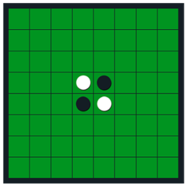
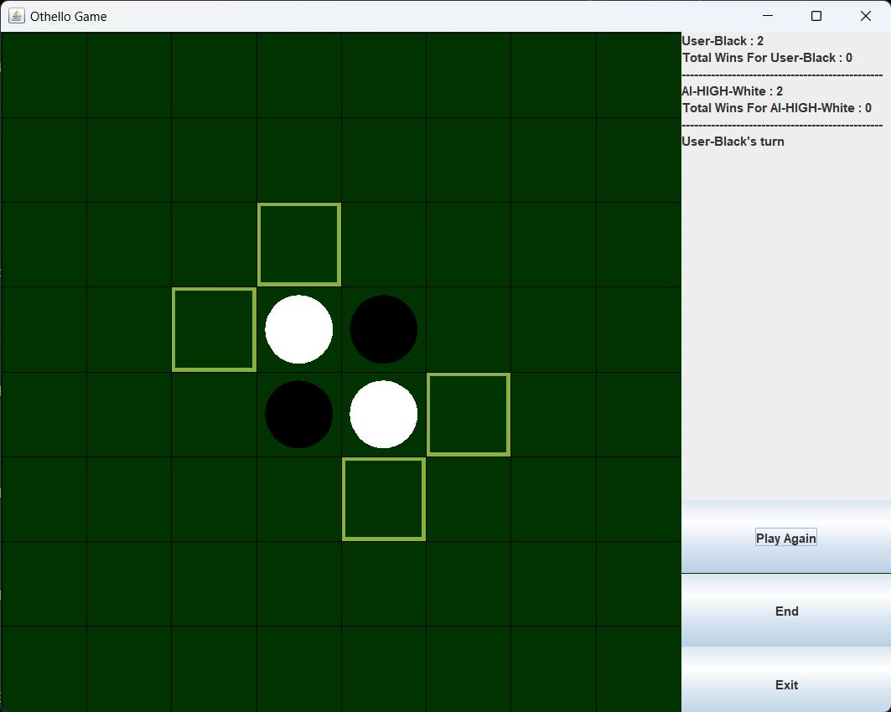
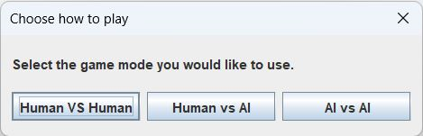
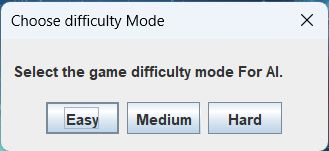
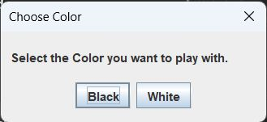
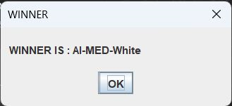

# Othello_AI

## Introduction
Othello is a two-player abstract strategy game played on a board with 8 rows and 8 columns and a set of 64 identical pieces. The pieces are usually discs with a bright and a dark face, with each colour representing one of the players. Players take turns making a "move," which consists of placing one disc with their assigned colour facing up on the board and then flipping over all of the opponent's discs that are "outflanked" by the disc that was just placed.  The goal of the game is to have the majority of one's own coloured pieces visible at the conclusion. 

## AI Algorithms and Heuristics 
The algorithm used in this AI model is the minmax algorithm with aplha-beta pruning 
### Supported Difficulty Levels
*	Easy		: depth of 1
*	Medium	: depth of 4 
*	Hard		: starting depth of 6 + iterative deepening

### Heuristics used
* Mobility
* Stability
* corner captured
* coin parity

These heuristics are used according to the paper with each has a weight assigned to it, to evaluate the score.

## GUI

First the game mode is selected 

### Supported Modes
* AI vs AI 
* AI vs Human
* AI vs AI

If one of the players is an AI difficulty mode is selected

In case of AI vs Human ,the user can choose which color (black plays first) is assigned to the human player.

Then the game starts 

At the end of the game the winner is announced

